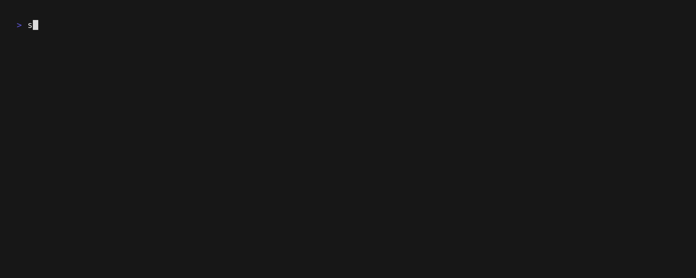

# sigscope

A CLI tool for inspecting VCD (Value Change Dump) files.

**[日本語版](./README.ja.md)**



## Features

- **Waveform Viewer**: Engineers can inspect waveforms interactively in the terminal
- **JSON Export**: AI agents can programmatically retrieve signal lists and waveform data

## Technical Specifications

- **Language**: Go 1.24.3
- **Dependencies**: Bubble Tea, Lip Gloss, fsnotify

## Installation

### Build Binary

```bash
git clone <repository-url>
cd sigscope
go build -o sigscope .
```

### Build with Nix

```bash
nix build
./result/bin/sigscope <path-to-project>/<vcd-file.vcd>
```

### Install with Go

```bash
go install github.com/hitsan/sigscope@latest
sigscope <path-to-project>/<vcd-file.vcd>
```

### Claude Code Skill Installation

This tool includes a skill for use with Claude Code.

```bash
cp -r .claude/skills/sigscope <path-to-project>/.claude/skills/
```

After installation, you can ask Claude Code to debug VCD files by saying "debug", "check waveform", etc. VCD debugging support will be available automatically.

## Usage

### 1. Waveform Viewer

View VCD files interactively.

```bash
sigscope <path-to-project>/<vcd-file.vcd>
```

#### Waveform Display Format

1-bit signals are displayed using the following characters:

```
clk:  __/‾‾\__/‾‾\__/‾‾\__
```

- `_` = LOW (0)
- `‾` = HIGH (1)
- `/` = Rising edge (0→1)
- `\` = Falling edge (1→0)
- `?` = Unknown value (x)
- `Z` = High-Z (z)

Multi-bit signals (buses) are displayed in hexadecimal:

```
data[7:0]: X--2A---X--FF---X--00---
```

- `X` = Value change point
- `-` = Stable value
- `2A`, `FF` = Hexadecimal values

#### TUI Controls

- `q` / `Ctrl+C`: Exit
- `j` / `k` / `↑` / `↓`: Navigate signals
- `h` / `l` / `←` / `→`: Scroll time window
- `H` / `L` / `Shift+←` / `Shift+→`: Page-wise scrolling
- `+` / `-` / `0`: Zoom in / Zoom out / Reset
- `g` / `G`: Jump to start / end
- `c`: Toggle cursor display
- `[` / `]`: Jump to previous / next transition
- `/`: Search mode
- `s`: Toggle signal selection mode
- `space`: Toggle visibility (selection mode only)
- `a` / `A`: Show all / Hide all (selection mode only)

### 2. Signal List

Extract all signals and metadata from a VCD file in JSON format.

```bash
sigscope list path/to/file.vcd
```

**Output example:**
```json
{
  "signals": [
    {"name": "TOP.module.clk", "width": 1},
    {"name": "TOP.module.data", "width": 8}
  ],
  "timescale": "1ps",
  "time_range": [0, 1000000]
}
```

### 3. Waveform Data Export (query)

Extract time-series events in JSON format. Only changed signals are recorded in differential format.

```bash
sigscope query [OPTIONS] path/to/file.vcd
```

**Options:**
- `-s, --signals <pattern>`: Signal name pattern (partial match, repeatable)
- `-t, --time-start <time>`: Start time (default: 0)
- `-e, --time-end <time>`: End time (default: VCD end time)

**Usage examples:**
```bash
# Export all signal waveforms
sigscope query waveform.vcd

# Specific signals only (partial match)
sigscope query -s clk -s data waveform.vcd

# Time range specification
sigscope query -t 1000 -e 5000 waveform.vcd

# Combined
sigscope query -s "udp_rx" -t 1000 -e 10000 waveform.vcd
```

**Output example:**
```json
{
  "timescale": "1ps",
  "defs": {
    "clk": {"w": 1},
    "data": {"w": 8, "radix": "hex"}
  },
  "clock": {
    "name": "clk",
    "period": 10000,
    "edge": "posedge"
  },
  "init": {
    "clk": "0",
    "data": "00"
  },
  "events": [
    {"t": 15000, "set": {"data": "2A"}},
    {"t": 25000, "set": {"data": "FF"}}
  ]
}
```

**Output format details:**
- `timescale`: VCD file timescale (e.g., `"1ps"`, `"1ns"`)
- `defs`: Signal bit widths and radix (hex/bin)
- `clock`: Auto-detected clock information (null if not detected)
- `init`: Initial values of each signal at start time
- `events`: Time-ordered change events (only changed signals recorded)

For details on agent integration, see [AGENT.md](./AGENT.md).
